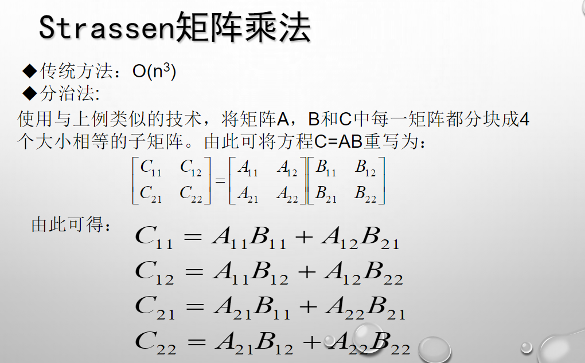
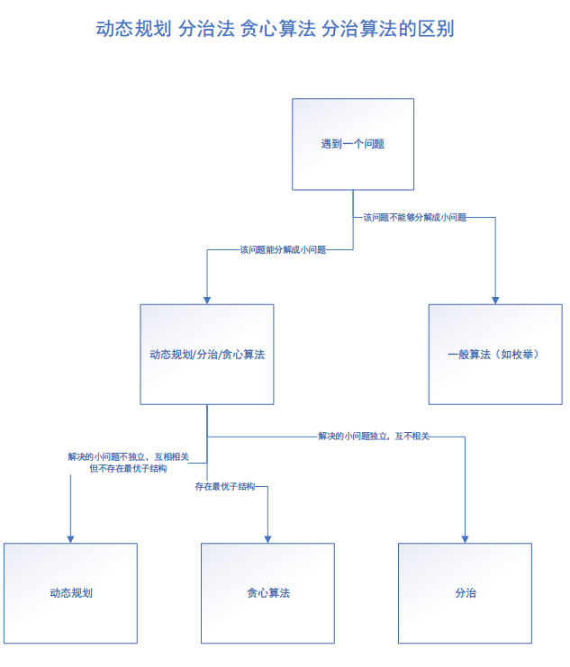
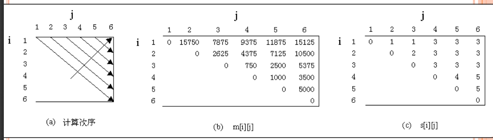
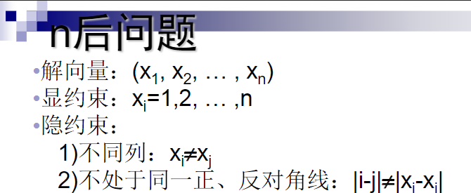
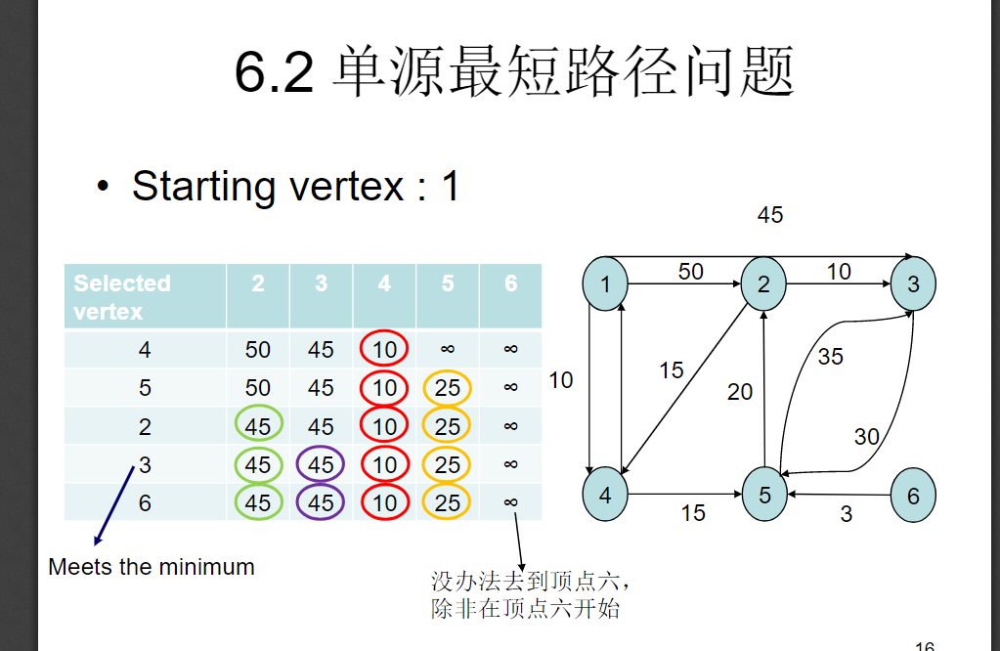

# 算法复习重点：

演算法：
输入 输出 明确性 有限性 有效性

表示时间复杂度和空间和复杂度

递归 recursive：函数调用自身算法叫递归算法，函数自身交递归函数

Fibonacci数列

```cpp
    int fibonacci(int n)
    {
        if(n <= 1)
            return 1;
        return fibonacci(n-1)+fibonacci(n-2);
    }
```

汉诺塔

```cpp
void hannoi (int n, char from, char buffer, char to)
{//n为盘子数量，来源杆子，缓冲杆子，目的杆子
    if (n == 0) return; //盘子数量为0则不再移动
    hannoi (n-1, from, to, buffer); //将来源杆上面n-1盘子通过目的杆移动到缓冲杆
    move(from,to);//将来源杆第n个盘子移动到目的杆
    hannoi (n-1, buffer, from, to);//将缓冲杆通过来源杆到目的杆
}
```

•Recursive 的优缺
1.优：程序代码较为精简
2.优：区域(暂存) 变数较少
3.优：占用的储存空间较少
4.缺：程序执行的时间较长、较无效率
5.缺：需要额外的Stack 支持

•Iterative 的优缺
1.优：程序执行的时间较短(不用额外处理push/pop)
2.优：不需额外的Stack 支持
3.缺：程序代码较冗长
4.缺：区域(暂存) 变数较多
5.缺：占用的储存空间较大

最大公因数

```cpp
intGCD(int a,intb)
{
    if(a%b==0)
    {
        return b;
    }
    else
    {
        return GCD(b,a%b);
    }
}
```

分治法：将求出的小规模的问题的解合并为一个更大规模的问题的解，自底向上逐步求出原来问题的解。

分治法所能解决的问题一般具有以下几个特征：

- 该问题的规模缩小到一定的程度就可以容易地解决
- 该问题可以分解为若干个规模较小的相同问题，即该问题具有最优子结构性质
- 利用该问题分解出的子问题的解可以合并为该问题的解
- 该问题所分解出的各个子问题是相互独立的，即子问题之间不包含公共的子问题。

二分搜索:

```cpp
int BinarySearch(Type a[], const Type& x, int l, int r)
{
    while (r >= l)
    {
        int m = (l+r)/2;
        if (x == a[m])
            return m;
        if (x < a[m])
            r = m-1;
        else  
            l = m+1;
    }
    return -1;
}
```



动态规划与分治法区别：动态规划问题不互相独立，而分治法问题独立。

动态规划算法，通常以自底向上的方式解各子问题，而贪心算法，则通常以自顶向下的方式进行。

0-1背包问题：

在选择装入背包的物品时，对每种物品i只有2种选择，即装入背包或不装入背包。不能将物品i装入背包多次，也不能只装入部分的物品i。
可以用动态规划。

背包问题：

与0-1背包问题类似，所不同的是在选择物品i装入背包时，可以选择物品i的一部分，而不一定要全部装入背包，1≤i≤n。
可以用贪心算法。

贪心算法：
首先计算每种物品单位重量的价值Vi/Wi，然后，依贪心选择策略，将尽可能多的单位重量价值「最高」的物品装入背包。若将这种物品全部装入背包后，背包内的物品总重量未超过C，则选择单位重量价值「次高」的物品并尽可能多地装入背包。依此策略一直地进行下去，直到背包装满为止。

最优子结构：如果一个问题的最优解可以从其子问题的最优解中构造出来，那么就说有一个问题具有最优的子结构。



Prim算法：
从出发点开始，以此找路径最短（权值最小的点）并且和其他未连通的点连通，然后再把联通的点当成出发点重复此步骤，直到所有点都联通，此图则为最小生成树。

Kruskal算法：
每次找路径最短（权值最小的点），如果未联通，则联通未联通的点，重复此步骤，直到所有点都联通，此图则为最小生成树。

回溯法：问题当需要找出它的解集或者要求回答什么解是满足某些约束条件的最佳解时使用。

常用剪枝函数：用约束函数在扩展结点处剪去不满足约束的子树；(0-1)用限界函数剪去得不到最优解的子树。(旅行）

回溯法以深度优先的方式搜索解空间树，而分支限界法则以广度优先或以最小耗费优先的方式搜索解空间树。

回溯法的求解目标是找出解空间树中满足约束条件的所有解，而分支限界法的求解目标则是找出满足约束条件的一个解，或是在满足约束条件的解中找出在某种意义下的最优解。

矩阵链乘法：


BFS(广度优先搜索算法)：

1. 首先将根节点放入队列中。
2. 从队列中取出第一个节点，并检验它是否为目标。
    - 如果找到目标，则结束搜索并回传结果。
    - 否则将它所有尚未检验过的直接子节点加入队列中。
3. 若队列为空，表示整张图都检查过了——亦即图中没有欲搜索的目标。结束搜索并回传“找不到目标”。
4. 重复步骤2。

DFS(深度优先搜索算法)：

1. 首先将根节点放入队列中。
2. 从队列中取出第一个节点，并检验它是否为目标。
    - 如果找到目标，则结束搜寻并回传结果。
    - 否则将它某一个尚未检验过的直接子节点加入队列中。
3. 重复步骤2。
4. 如果不存在未检测过的直接子节点。
    - 将上一级节点加入队列中。
    - 重复步骤2。
5. 重复步骤4。
6. 若队列为空，表示整张图都检查过了——亦即图中没有欲搜寻的目标。结束搜寻并回传“找不到目标”。

n皇后问题：


常见的两种分支限界法
（1）队列式(FIFO)分支限界法按照队列先进先出（FIFO）原则选取下一个节点为扩展节点。
（2）优先队列式分支限界法按照优先队列中规定的优先级选取优先级最高的节点成为当前扩展节点。

单源最短路径，迪杰斯特拉算法：

```fake
function Dijkstra(G, w, s)
     for each vertex v in V[G]        // 初始化
           d[v] := infinity           // 将各点的已知最短距离先设成无穷大
           previous[v] := undefined   // 各点的已知最短路径上的前趋都未知
     d[s] := 0                        // 因为出发点到出发点间不需移动任何距离，所以可以直接将s到s的最小距离设为0
     S := empty set
     Q := set of all vertices
     while Q is not an empty set      // Dijkstra算法主体
           u := Extract_Min(Q)
           S.append(u)
           for each edge outgoing from u as (u,v)
                  if d[v] > d[u] + w(u,v)             // 拓展边（u,v）。w(u,v)为从u到v的路径长度。
                        d[v] := d[u] + w(u,v)         // 更新路径长度到更小的那个和值。
                        previous[v] := u              // 纪录前趋顶点
```


